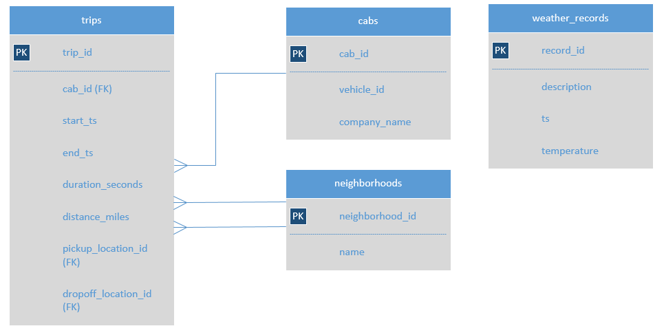

# Análisis de viajes en taxi en Chicago

Este análisis tiene como objetivo identificar patrones en los datos disponibles, comprender las preferencias de los pasajeros y evaluar el impacto de factores externos, como las condiciones climáticas, en los viajes en taxi de la ciudad de Chicago.

## Extracción de datos climáticos

Se implementó un código para extraer datos climáticos de Chicago correspondientes a noviembre de 2017, utilizando información de [este sitio web](https://practicum-content.s3.us-west-1.amazonaws.com/data-analyst-eng/moved_chicago_weather_2017.html). Posteriormente, estos datos fueron analizados.

El código utilizado fue el siguiente:

```python 
import pandas as pd 
import requests  # Importa la librería para enviar solicitudes al servidor 
from bs4 import BeautifulSoup  # Importa la librería para analizar la página web

req = requests.get('https://practicum-content.s3.us-west-1.amazonaws.com/data-analyst-eng/moved_chicago_weather_2017.html') 
soup = BeautifulSoup(req.text, 'lxml') 
table = soup.find('table',attrs={"id": "weather_records"})

heading_table = []  # Lista para guardar los encabezados de columna
for row in table.find_all('th'): # Los nombres de las columnas están dentro de los elementos <th>
    heading_table.append(row.text)

content = []  # Lista para almacenar los datos de la tabla
for row in table.find_all('tr'):
    if not row.find_all('th'):
        # Condición para ignorar la primera fila de la tabla, con encabezados
        content.append([element.text for element in row.find_all('td')])

# Crear tabla y mostrarla
weather_records = pd.DataFrame(content, columns=heading_table)
print(weather_records)
```
El resultado del código fue el siguiente:
```
     Date and time          Temperature    Description
0    2017-11-01 00:00:00     276.150     broken clouds
1    2017-11-01 01:00:00     275.700  scattered clouds
2    2017-11-01 02:00:00     275.610   overcast clouds
3    2017-11-01 03:00:00     275.350     broken clouds
4    2017-11-01 04:00:00     275.240     broken clouds
5    2017-11-01 05:00:00     275.050   overcast clouds
6    2017-11-01 06:00:00     275.140   overcast clouds
7    2017-11-01 07:00:00     275.230   overcast clouds
8    2017-11-01 08:00:00     275.230   overcast clouds
9    2017-11-01 09:00:00     275.320   overcast clouds
..                   ...         ...               ...
687  2017-11-29 15:00:00     275.210      sky is clear
688  2017-11-29 16:00:00     278.030      sky is clear
689  2017-11-29 17:00:00     279.580      sky is clear
690  2017-11-29 18:00:00     280.310        few clouds
691  2017-11-29 19:00:00     281.050        few clouds
692  2017-11-29 20:00:00     281.340        few clouds
693  2017-11-29 21:00:00     281.690      sky is clear
694  2017-11-29 22:00:00     281.070        few clouds
695  2017-11-29 23:00:00     280.060      sky is clear
696  2017-11-30 00:00:00     278.460      sky is clear

[697 rows x 3 columns]
```

Con esta información se creó la tabla `weather_records`.

## Analizar base de datos
Se cuenta con una base de datos que contiene información sobre viajes en taxi en Chicago. A continuación se presentan dos consultas relevantes.



### Tabla 1: Cantidad de viajes por compañía

Esta tabla muestra la cantidad de viajes realizados por cada compañía de taxis durante el 15 y 16 de noviembre de 2017. Los resultados están ordenados de manera descendente según el número de viajes:


Esto se hace con el siguiente código `SQL`:
```SQL
SELECT
    cabs.company_name,
    COUNT(trips.trip_id) AS trips_amount
FROM 
    cabs
    INNER JOIN 
    trips 
    ON 
    trips.cab_id = cabs.cab_id
WHERE 
    CAST(trips.start_ts AS date) BETWEEN '2017-11-15' AND '2017-11-16'
GROUP BY 
    company_name
ORDER BY 
    trips_amount DESC;
```
Resultado:
```
company_name                         trips_amount
Flash Cab                             19558
Taxi Affiliation Services             11422
Medallion Leasin                      10367
Yellow Cab                            9888
Taxi Affiliation Service Yellow       9299
...
```

Esta información fue almacenada como `df_company`

### Tabla 2: Condiciones climáticas y duración de los viajes

Se analizaron los viajes realizados los sábados desde el Loop (pickup_location_id: 50) hacia el aeropuerto O'Hare (dropoff_location_id: 63). Las condiciones climáticas se clasificaron en:

- **Bad**: Condiciones que incluyen "rain" o "storm".
- **Good**: Otras condiciones climáticas.

Solo se incluyeron los viajes con información climática disponible.

Consulta SQL:

- Se crea la condición para separar las condiciones de clima
```SQL
SELECT
    DATE_TRUNC('hour',ts) AS ts,
    CASE WHEN description LIKE '%rain%' THEN 'Bad'
         WHEN description LIKE '%storm%' THEN 'Bad'
        ELSE 'Good' END AS weather_conditions
FROM
    weather_records;
```

El resultado del código anterior fue el siguiente:
```
ts	weather_conditions
2017-11-01 00:00:00	Good
2017-11-01 01:00:00	Good
2017-11-01 02:00:00	Good
2017-11-01 03:00:00	Good
2017-11-01 04:00:00	Good
...
2017-11-09 03:00:00	Good
2017-11-09 04:00:00	Good
2017-11-09 05:00:00	Good
2017-11-09 06:00:00	Good
2017-11-09 07:00:00	Good
```
- Con el método anterior, se unifican los datos requeridos:
  
```SQL
SELECT
    start_ts,
    T.weather_conditions,
    duration_seconds
FROM 
    trips INNER JOIN (
        SELECT
            ts,
        CASE WHEN description LIKE '%rain%' OR description LIKE '%storm%' THEN 'Bad'
            ELSE 'Good' END AS weather_conditions
        FROM weather_records) T on T.ts = trips.start_ts
WHERE 
    pickup_location_id = 50 AND dropoff_location_id = 63 
    AND EXTRACT (DOW from trips.start_ts) = 6
ORDER BY trip_id;
```

El resultado del código anterior fue el siguiente:
```
start_ts	            weather_conditions	duration_seconds
2017-11-25 12:00:00	    Good	            1380
2017-11-25 16:00:00	    Good	            2410
2017-11-25 14:00:00	    Good	            1920
2017-11-25 12:00:00	    Good	            1543
2017-11-04 10:00:00	    Good	            2512
...
2017-11-11 12:00:00	    Good	            1981
2017-11-11 08:00:00	    Good	            1200
2017-11-04 11:00:00	    Good	            2160
2017-11-11 15:00:00	    Good	            2400
2017-11-11 20:00:00	    Good	            1500
```

Esta información fue almacenada en el DataFrame `df_trips_la`.

## Conclusión

Los datos obtenidos y las tablas generadas están listos para un análisis más detallado en el archivo Python adjunto.

[Análisis completo en Python](https://github.com/javu98/recopilaci-n-y-almacenamiento-de-datos-con-SQL/blob/main/an%C3%A1lisis_de_viajes_de_taxis_en_chicago.ipynb)
